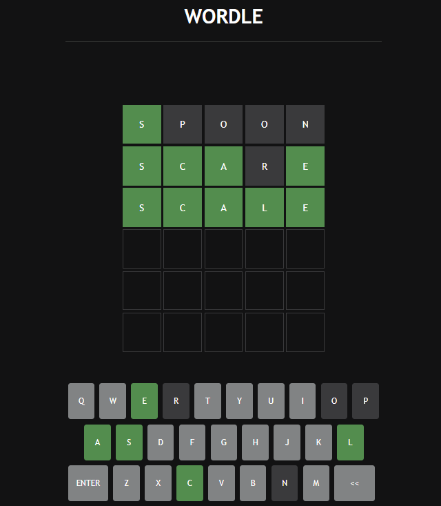

# WORDLE CLONE


# API
https://rapidapi.com/sheharyar566/api/random-words5/
https://rapidapi.com/twinword/api/word-dictionary/

# How to use
First you need to download project.
```
git clone https://github.com/rknyryn/Wordle-Clone.git
```
Write your API keys in the app.js file. And then you can open the index.html with browser.

# Author
* **Ramazan Kaan Yarayan** - [Github](https://github.com/rknyryn)